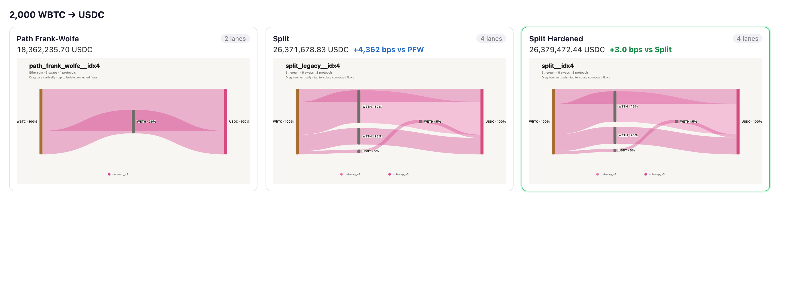
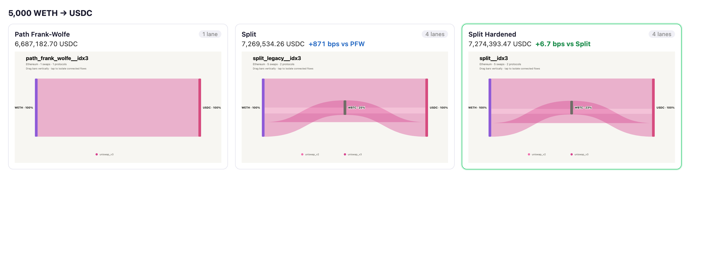
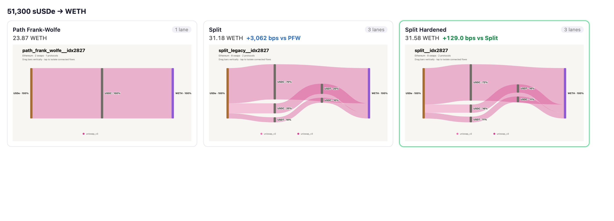
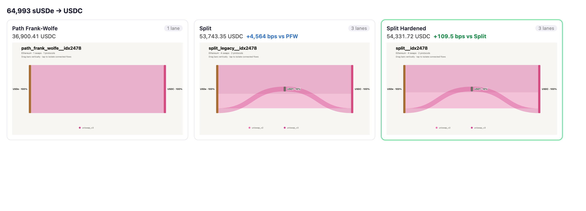

# feat: harden split routing (portfolio split) + port path_frank_wolfe + route-viz

## Summary

- Replace the exhaustive `split` algorithm with a **portfolio split router** (developed and
  benchmarked as `split_max`). It water-fills large orders across pool-disjoint paths using an
  incremental marginal probe (O(chunks) instead of O(chunks²), exploiting AMM path-independence in
  cumulative input), which funds a 256-chunk allocation grid vs the old 20-chunk grid. It picks the
  active path set at coarse granularity where the gas-activation gate is correct, then refines
  allocation over that set, and returns the best net of {single path, an incumbent-cost coarse split
  (a floor that can't be starved under a tight timeout), the refined split}. `SplitAlgorithm` now
  delegates to it, so production and the offline harness run it under the name `split`.
- Result on the 10k offline dataset vs the old exhaustive split: **0 losses over 5,891 solved
  trades, 704 wins, up to +129 bps, identical coverage, ~+0.4 ms p50 solve latency (~5%)**. As a
  worker pool with `bellman_ford`, the hardened pool beats a `{split, bellman_ford}` pool 703–0.
- Port `path_frank_wolfe` (and its `bellman_ford` / `split_primitives` dependencies) from `main`, so
  every algorithm runs on the same frozen snapshot. This branch had diverged from an older `main`
  before PFW landed.
- Offline harness: `quality` now reports `p50/p95/max` solve latency; new `routes` subcommand dumps
  solved routes per algorithm in the route-visualization normalized schema.

## Validation

`cargo +nightly clippy -D warnings` clean; `cargo nextest run -p fynd-core`: 465 passed, 6 skipped.
Never-lose guarantee is enforced by `portfolio_never_loses_to_incumbent_split` and
`portfolio_no_loss_under_tight_timeout`.

## Benchmarks (offline, frozen `market_snapshot.json`, `--max-hops 3 --timeout-ms 5000`)

| algorithm | coverage | wins vs split(old) | losses | mean bps | p50 | p95 |
|---|---:|---:|---:|---:|---:|---:|
| `split` (portfolio) | 5,891 | 704 | 0 | +0.19 (all) / +1.6 (wins) | 9.4 ms | 26.9 ms |
| `split` (old exhaustive) | 5,891 | — | — | 0 | 8.9 ms | 26.5 ms |

Details and reproduction in `docs/routing-quality-bench.md`.

## Large-trade routing: Path Frank-Wolfe vs Split vs Split Hardened

Offline routes for the same order on the frozen snapshot, rendered as Classic Sankeys (token bars
sized by flow, ribbon width = each leg's share of the order). "Split" is the previous exhaustive
split (20-chunk allocation); "Split Hardened" is the portfolio (256-chunk). Single-path Path
Frank-Wolfe is shown for reference.

| trade | Path Frank-Wolfe | Split | Split Hardened |
|---|---:|---:|---:|
| 2,000 WBTC → USDC | 18,362,236 (2 lanes) | 26,371,679 (4) | **26,379,472** (4) — +4,362 bps vs PFW |
| 5,000 WETH → USDC | 6,687,183 (1) | 7,269,534 (4) | **7,274,393** (4) — +877 bps vs PFW, +6.7 vs Split |
| 51,300 sUSDe → WETH | 23.87 (1) | 31.18 (3) | **31.58** (3) — +129.0 bps vs Split |
| 64,993 sUSDe → USDC | 36,900 (1) | 53,743 (3) | **54,332** (3) — +109.5 bps vs Split |

On XXL trades the single-path algorithms take severe price impact (2,000 WBTC → USDC through one
pool yields ~11.2M; PFW's 2-leg split reaches 18.4M; the portfolio's 4-leg split reaches 26.4M). On
mid-size trades the hardening delta shows as a finer allocation over the same pools — e.g. Split's
round 70/20/10 grid vs Split Hardened's 72/16/11 for 51,300 sUSDe → WETH (+129 bps).

**2,000 WBTC → USDC**

**5,000 WETH → USDC**

**51,300 sUSDe → WETH**

**64,993 sUSDe → USDC**

## Note on scope

Bringing `path_frank_wolfe` in also replaced this branch's `bellman_ford` with `main`'s version (PFW
depends on `BellmanFordContext` / `FindRouteOptions` added on `main`). BF's reference numbers shift
accordingly; the split-vs-old-split comparison is unaffected (split does not use `bellman_ford`).
