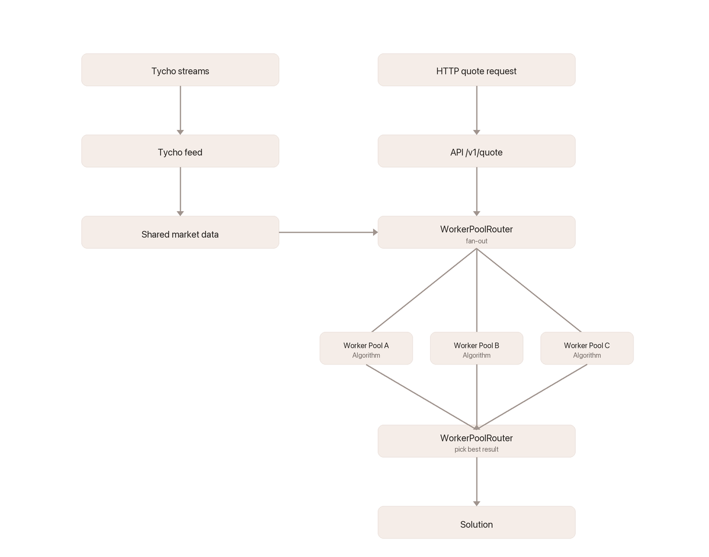

# Overview

## What is Fynd?

Fynd is an open-source DEX aggregator that runs locally on your server. We built Fynd to be **reliable** and **trustless.**

Fynd gives you quotes in 20ms, supports 1.000 RPS on commodity hardware (see [performance](reference/benchmark-results.md)), does not overquote, and is configurable to the pools, tokens, and objectives you care about (low reverts, best price, low latency, etc.).

Fynd builds on [Tycho](https://www.propellerheads.xyz/tycho) the open source DEX indexer (see the [protocols it supports](https://docs.propellerheads.xyz/tycho/for-solvers/supported-protocols)).

## Own Your Routing 

Route APIs are simple, but the tradeoffs are painful: rate limits, network overhead, no transparency, unreliable uptime, and unexplainable slippage. And you can't fix any of it.

Fynd puts you in control:

1. **Real-time market state** via Tycho Stream, covering all [Tycho-supported protocols](https://docs.propellerheads.xyz/tycho/for-solvers/supported-protocols)
2. **As fast as 10ms per quote:** You choose the balance between routing quality and latency.
3. **Custom algorithms:** Plug in your own algorithm or customize the pre-built one. Fynd runs multiple algorithms in parallel and picks the best result.
4. **Execution on your terms:** Encode and execute swaps on-chain with full control over fees, slippage, and token transfer method.
5. **Vertical scaling:** Scale up to meet your speed requirements.

### Key Design Principles

* **Single source of truth**: All market data lives in one `MarketState` structure. A single feed writes to it; all workers read from it. No duplication.
* **Algorithm-agnostic**: Built around a pluggable `Algorithm` trait. Different algorithms use different graph representations and strategies. Multiple algorithms compete in parallel; the best result wins.
* **Performance-first**: CPU-bound route finding runs on dedicated OS threads (not the async runtime). Each worker pool has its own task queue for independent backpressure and scaling.
* **Observability built-in**: Prometheus metrics, structured logging via `tracing`, and health endpoints are first-class citizens.

### Order Types

Fynd currently supports **sell orders** only (exact input amount). You specify the amount of the input token, and Fynd finds the best output. Buy orders (exact output) are not yet supported.

### Supported Chains

* Ethereum Mainnet
* Base
* Unichain

_Coming soon_: Arbitrum, Polygon, and BSC.

### Supported Protocols

Fynd works with any protocol Tycho supports. See the [list of supported protocols](https://docs.propellerheads.xyz/tycho/for-solvers/supported-protocols) and [supported RFQs](https://docs.propellerheads.xyz/tycho/for-solvers/request-for-quote-protocols#quickstart).

### How It Works

<figure><picture><source srcset=".gitbook/assets/how-it-works-darkmode.png" media="(prefers-color-scheme: dark)"></picture><figcaption></figcaption></figure>

1. **TychoFeed** connects to **Tycho Streams** ([on-chain protocols](https://docs.propellerheads.xyz/tycho/for-solvers/simulation#streaming-protocol-states) and [RFQs](https://docs.propellerheads.xyz/tycho/for-solvers/request-for-quote-protocols#stream-real-time-price-updates)) and processes market updates (added/removed components and state changes) every block.
2. **MarketState** stores all component states, tokens, and gas prices in a single shared structure.
3. When a **quote request** arrives via HTTP, the **WorkerPoolRouter** fans it out to all worker pools in parallel.
4. Each **Worker Pool** runs a specific algorithm. Workers compete to pick up the task, find routes through their local graph, simulate swaps against shared market state, and return ranked results.
5. The **WorkerPoolRouter** collects results from all pools, picks the best solution by `amount_out_net_gas`, optionally encodes it for execution against the `TychoRouter`, and returns it.

## Try it out

Head to the [quickstart](get-started/quickstart/README.md) to get Fynd running.
