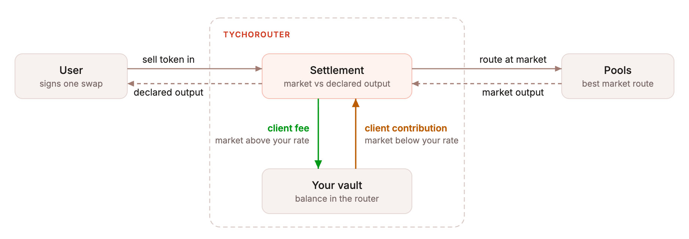

# Stable Swap Rate

Fix the output rate of a token pair for your users. Fynd routes the swap at market and settles the difference against your vault balance in the TychoRouter. You keep full control of the rate, every swap settles onchain in one transaction, and there is no counterparty that can go offline.

Stable Swap Rate is built from two primitives you may already use: the [client fee](client-fees.md) and the [client contribution](client-fees.md#maxclientcontribution).

Stable Swap Rate runs as a separate Fynd server that we host for you, with its own base URL. It accepts the same requests as the standard Fynd API and returns the same responses, plus an API extension with Stable Swap Rate fields.


**Beta.** Stable Swap Rate is available to selected integrators. To get access, contact us on [Telegram](https://t.me/+B4CNQwv7dgIyYTJl).


## How it works

1. You declare the rate your user sees, for example 1 USDC = 1 USDT.
2. Fynd finds the best market route, as for any quote.
3. When the market quote is above your declared output, the surplus goes to your vault as a client fee.
4. When the market quote is below your declared output, your vault tops the output up to the declared amount as a client contribution.
5. The router settles atomically and your user receives the declared amount.

<figure><picture><source srcset="../.gitbook/assets/stable-swap-rate-flow-darkmode.png" media="(prefers-color-scheme: dark)"></picture><figcaption></figcaption></figure>

Fynd encodes the declared rate into the same `ClientFee` payload that [client fees](client-fees.md) use. The fee moves surplus into your vault, and `maxClientContribution` caps how much the router may take from your vault to cover a shortfall. No new contract sits between your user and the router. The vault only settles the difference between your declared rate and the onchain rate, so a declared rate that tracks the market needs only a small float.

The formula uses three inputs:

- **Market quote (`Q`)**: what the best onchain route returns for the input amount right now. It moves with the market.
- **Declared output (`D`)**: what you promise your user, at the rate you set. For 1,000,000 USDC at 1 USDC = 1 USDT, `D` is 1,000,000 USDT, whatever the market does.
- **Depeg tolerance**: the largest gap, in basis points of `D`, that your vault covers when the market is below your rate.

```
1. expected_amount_out     = max(Q, D)
2. min_amount_out          = D
3. client_fee              = Q > D ? Q - D : 0
4. client_contribution     = Q < D ? D - Q : 0
5. max_client_contribution = D * depeg_tolerance_bps / 10,000
6. amount_received         = D
```

Favorable price movement between quote time and execution above `expected_amount_out` is captured by the router, as in every Fynd swap. See [Fynd Fees](router-fees.md).

### Example: market above your rate

1,000,000 USDC in, declared 1,000,000 USDT out, market quote 1,000,300 USDT:

```
client_fee          = 1,000,300 - 1,000,000 = 300   -> your vault
client_contribution = 0
user receives       = 1,000,000
```

### Example: market below your rate

1,000,000 USDC in, declared 1,000,000 USDT out, market quote 999,700 USDT, 30 bps depeg tolerance:

```
max_client_contribution = 1,000,000 * 30 / 10,000 = 3,000
client_fee              = 0
client_contribution     = 1,000,000 - 999,700 = 300   <- your vault
user receives           = 1,000,000
```

## Quote response

Your Stable Swap Rate server accepts the same `POST /v1/{chain}/quote` request as Fynd. Enable encoding, and you get the same `OrderQuote` back. The `fee_breakdown` and the encoded `transaction` are the standard ones, so an existing Fynd client only needs a different base URL. Encoding is required because the fixed rate lives in the transaction's `ClientFee` payload. See [encoding options](encoding-options.md).

Each quote also carries the Stable Swap Rate API extension. Use it to show your user the declared rate next to the market, and to monitor how far the market drifts from your rate and how much your vault subsidizes.

| Field                        | Type      | Description                                                          |
| ---------------------------- | --------- | -------------------------------------------------------------------- |
| `declared_amount_out`        | `string`  | Output at your declared rate. This is what the user receives.        |
| `market_amount_out`          | `string`  | Output of the market route at quote time.                            |
| `router_expected_amount_out` | `string`  | `max(market, declared)`, encoded as `expectedAmountOut` in the tx.   |
| `client_fee_bps`             | `integer` | Client fee that moves the surplus into your vault. `0` when none.    |
| `max_client_contribution`    | `string`  | Cap on the subsidy your vault pays for this swap.                    |
| `deadline`                   | `integer` | Unix timestamp after which the quote is no longer valid.             |
| `gap_bps`                    | `integer` | Signed distance between market and declared output in basis points. |

All amounts are in output token units.

## Hosted deployment

We host the Stable Swap Rate server for you on any chain Fynd supports, for any token pair and any rate policy. Onboarding is guided. Together we:

1. Pick the chain, the token pair, and the rate policy your users see.
2. Set the depeg tolerance, the quote validity window, and the float you keep in your TychoRouter vault. See the [vault mechanism](https://docs.propellerheads.xyz/tycho/for-solvers/execution/vault) in the Tycho docs.
3. Point your app at your base URL. Quotes come back signed and ready to submit, so your app does no signing.
4. Monitor your vault balance. It moves on every swap, and you top it up as needed.

## Get access

Stable Swap Rate is in Beta. Contact us on [Telegram](https://t.me/+B4CNQwv7dgIyYTJl) with your pairs, chains, expected volume, and whether you already hold vault inventory.
